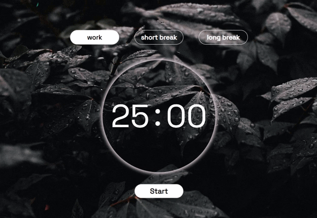

# Pomodoro Timer

Simple and minimalist pomodoro timer

 

<h3 align="center">
    
</h3>

## 🛠️ Technologies
  * [Html](https://www.w3schools.com/html/)
  * [Css](https://www.w3schools.com/css/)
  * [Javascript](https://www.javascripttutorial.net/)

## 🚀 Features 

✅ Work time = 25 minutes  
✅ Long Break time = 10 minutes  
✅ Short Break time = 5 minutes  
✅ Timer reset button
